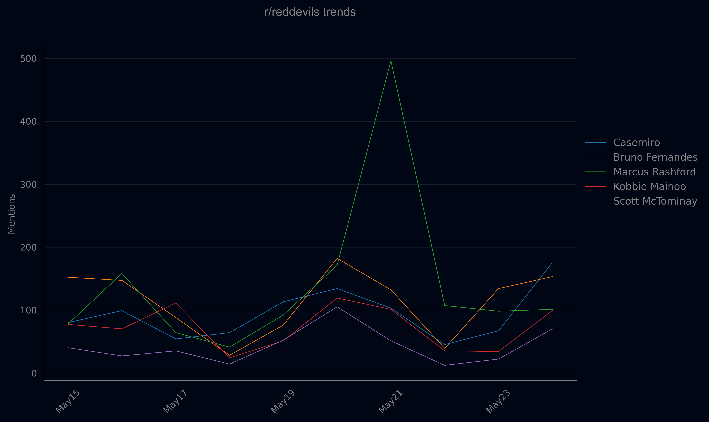

# Trend Chart Reddit Bot

It is a Reddit bot designed to analyze and visualize the number of times football players are mentioned in a specific subreddit every 24 hours. The bot generates a line chart of the top 5 most trending players, saves it as a png file and posts this chart in a test subreddit.



## Features

- Fetches the latest posts and comments from a subreddit.
- Analyzes the mentions of specified football players.
- Generates a line chart showing the trend of mentions for the top 5 players.
- Saves the generated chart as an image.
- Automatically creates a submission in a test subreddit with the generated chart.

## Dependencies

To run this project, you need the following dependencies:

- Python 3.x
- PRAW (Python Reddit API Wrapper)
- Matplotlib
- Pandas
- python-dotenv

## Setup

1. Clone this repository to your local machine.
2. Install the required dependencies:
```sh
pip install praw matplotlib pandas python-dotenv
```
3. Create a `.env` file in the same directory as your script with your Reddit app credentials:
```env
CLIENT_ID=YOUR_CLIENT_ID
CLIENT_SECRET=YOUR_CLIENT_SECRET
USERNAME=YOUR_USERNAME
PASSWORD=YOUR_PASSWORD
USER_AGENT=YOUR_USER_AGENT
```
4. Save the football players' information in `team_data.py`. You can add the strings you want to count and strings which should be avoided:
```dict
    {
        'Name': 'Scott McTominay',
        'Include': ['Scott', 'McTominay', 'McT', 'McSauce'],
        'Exclude': ['Scott McTominay', 'Scott McT'],
    }
```
5. Save the daily data in `data_points.csv`:

| Player           | May15 | May16 | May17 | May18 | May19 | May20 | May21 | May22 | May23 | May24 |
|------------------|-------|-------|-------|-------|-------|-------|-------|-------|-------|-------|
| Bruno Fernandes  | 152   | 147   | 88    | 28    | 76    | 182   | 132   | 39    | 134   | 153   |
| Marcus Rashford  | 78    | 158   | 64    | 41    | 92    | 171   | 496   | 107   | 98    | 101   |
| Rasmus Højlund   | 53    | 69    | 93    | 20    | 132   | 151   | 73    | 29    | 27    | 47    |

## File Structure

- `team_data.py`: Contains information about the players.
- `data_points.csv`: Stores the daily data points.
- `chart.py`: Contains the code for generating and saving the chart.
- `main.py`: Main script for fetching data, analyzing mentions, generating the chart and creating post.

## Post Example

The bot will create a post in the test subreddit with a title and body similar to the following:

#### Title: Top 5 Trending Players in r/reddevils

#### Body:

```
Hello,

I’m a bot that tracks the top 5 most mentioned football players in r/reddevils every 24 hours. Each day, I’ll post a line chart showing the trends.

How you can help:

- Share feedback and suggestions in the comments.
- Report any issues you notice.

Your input helps improve this bot. Thanks for being part of the community!
'''
